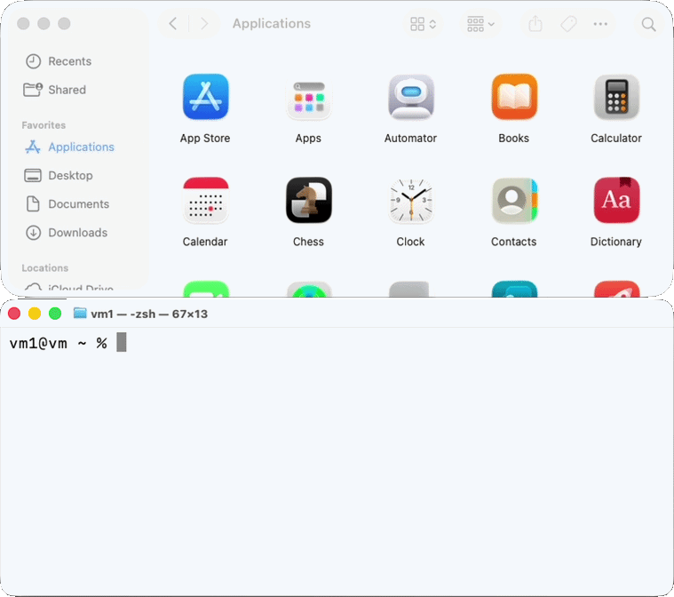

# Homebrew Cask

_“To install, drag this icon…” no more!_

Homebrew Cask extends [Homebrew](https://brew.sh) and brings its elegance, simplicity, and speed to the installation and management of GUI macOS applications such as Visual Studio Code and Google Chrome.

We do this by providing a friendly CLI workflow for the administration of macOS applications distributed as binaries.

[](https://github.com/orgs/Homebrew/discussions/categories/casks)

## Let’s try it!

To start using Homebrew Cask, you just need [Homebrew](https://brew.sh) installed.

<div align="center">
  
</div>

Slower, now:

```console
% brew install alfred
==> Fetching downloads for: alfred 
✔︎ Cask alfred (5.7.2,2312)                                           Verified      5.6MB/  5.6MB
==> Installing Cask alfred
==> Moving App 'Alfred 5.app' to '/Applications/Alfred 5.app'
🍺  alfred was successfully installed!
```

And there we have it. An application installed with one quick command: no clicking, no dragging, no dropping.

## Learn More

* Find basic documentation on using Homebrew Cask in [USAGE.md](USAGE.md).
* Want to contribute a cask? Awesome! See [CONTRIBUTING.md](CONTRIBUTING.md).
* More project-related details and discussion are available in the [documentation](https://docs.brew.sh/Adding-Software-to-Homebrew#casks).

## Reporting Bugs

[**If you ignore this guide, your issue may be closed without review**](doc/faq/closing_issues_without_review.md)

Before reporting a bug, run `brew update-reset && brew update` and try your command again. This is a fix-all that will reset the state of all your taps, ensuring the problem isn’t an outdated setup on your side.

If your issue persists, [search for it](https://github.com/Homebrew/homebrew-cask/search?type=Issues) before opening a new one. If you find an open issue and have any new information, add it in a comment. If you find a closed issue, try the solutions there.

If the issue is still not solved, see the guides for common problems:

* [Examples of common errors and their solutions](doc/reporting_bugs/error_examples.md)
  * [`curl` error](doc/reporting_bugs/error_examples.md#curl-error)
  * [`Permission denied` error](doc/reporting_bugs/error_examples.md#permission-denied-error)
  * [`Checksum does not match` error](doc/reporting_bugs/error_examples.md#checksum-does-not-match-error)
  * [`source is not there` error](doc/reporting_bugs/error_examples.md#source-is-not-there-error)
  * [`wrong number of arguments` error](doc/reporting_bugs/error_examples.md#wrong-number-of-arguments-error)
* [App isn’t included in `upgrade`](https://docs.brew.sh/FAQ#why-arent-some-apps-included-during-brew-upgrade)
* [The app can’t be opened because it is from an unidentified developer](https://docs.brew.sh/FAQ#why-cant-i-open-a-mac-app-from-an-unidentified-developer)
* [My problem isn’t listed](https://github.com/Homebrew/homebrew-cask/issues/new?template=01_bug_report.yml)

## Requests

* Issues requesting new casks will be closed. If you want a cask added to the main repositories, [submit a pull request](https://github.com/Homebrew/homebrew-cask/blob/HEAD/CONTRIBUTING.md#adding-a-cask).
* For a feature request, [use this template](https://github.com/Homebrew/brew/issues/new?assignees=&labels=features&projects=&template=feature.yml).

## Questions? Wanna chat?

We’re really rather friendly! Here are the best places to talk about the project:

* [Open an issue](https://github.com/Homebrew/homebrew-cask/issues/new/choose).
* Join us on [GitHub discussions (forum)](https://github.com/orgs/Homebrew/discussions/categories/casks).

## License

Code is under the [BSD 2 Clause (NetBSD) license](LICENSE).
