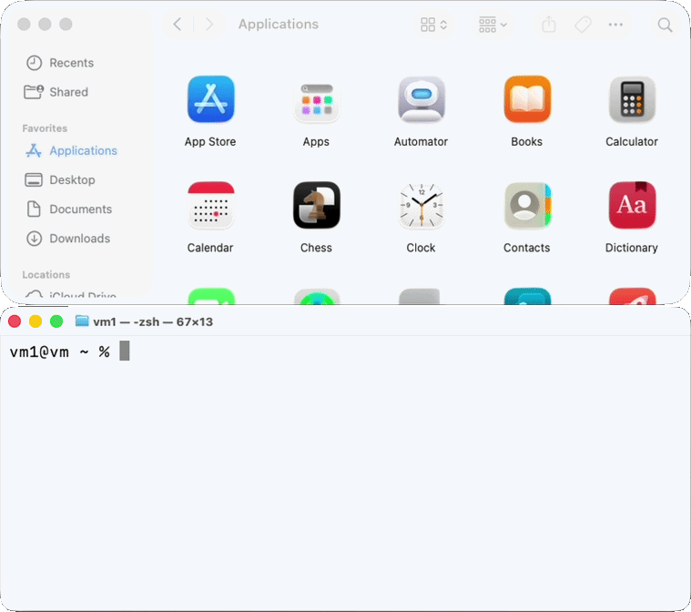

# Homebrew Cask

_“To install, drag this icon…” no more!_

Homebrew Cask extends [Homebrew](https://brew.sh) and brings its elegance, simplicity, and speed to the installation and management of prebuilt software artifacts distributed by upstream vendors, including GUI applications, CLI tools, fonts, plugins, and other packaged software.

We do this by providing a friendly CLI workflow for the administration of these artifacts on macOS and Linux.

[](https://github.com/orgs/Homebrew/discussions/categories/casks)

## Let’s try it!

To start using Homebrew Cask, you just need [Homebrew](https://brew.sh) installed.

<div align="center">
  
</div>

Slower, now:

```console
% brew install alfred
==> Fetching downloads for: alfred
✔︎ Cask alfred (5.7.2,2312)                                           Verified      5.6MB/  5.6MB
==> Installing Cask alfred
==> Moving App 'Alfred 5.app' to '/Applications/Alfred 5.app'
🍺  alfred was successfully installed!
```

And there we have it. An application installed with one quick command: no clicking, no dragging, no dropping.

## Learn More

* Find basic documentation on using Homebrew Cask in [USAGE.md](USAGE.md).
* Want to contribute a cask? Awesome! See [CONTRIBUTING.md](CONTRIBUTING.md).
* More project-related details and discussion are available in the [documentation](https://docs.brew.sh/Adding-Software-to-Homebrew#casks).

## Reporting Bugs

[**If you ignore this guide, your issue may be closed without review**](doc/faq/closing_issues_without_review.md)

Before reporting a bug, run `brew update-reset && brew update` and try your command again. This is a fix-all that will reset the state of all your taps, ensuring the problem isn’t an outdated setup on your side.

If your issue persists, [search for it](https://github.com/Homebrew/homebrew-cask/search?type=Issues) before opening a new one. If you find an open issue and have any new information, add it in a comment. If you find a closed issue, try the solutions there.

If the issue is still not solved, see the guides for common problems:

* [Examples of common errors and their solutions](doc/reporting_bugs/error_examples.md)
  * [`curl` error](doc/reporting_bugs/error_examples.md#curl-error)
  * [`Permission denied` error](doc/reporting_bugs/error_examples.md#permission-denied-error)
  * [`Checksum does not match` error](doc/reporting_bugs/error_examples.md#checksum-does-not-match-error)
  * [`source is not there` error](doc/reporting_bugs/error_examples.md#source-is-not-there-error)
  * [`wrong number of arguments` error](doc/reporting_bugs/error_examples.md#wrong-number-of-arguments-error)
* [App isn’t included in `upgrade`](https://docs.brew.sh/FAQ#why-arent-some-apps-included-during-brew-upgrade)
* [The app can’t be opened because it is from an unidentified developer](https://docs.brew.sh/FAQ#why-cant-i-open-a-mac-app-from-an-unidentified-developer)
* [My problem isn’t listed](https://github.com/Homebrew/homebrew-cask/issues/new?template=01_bug_report.yml)

## Requests

* Issues requesting new casks will be closed. If you want a cask added to the main repositories, [submit a pull request](https://github.com/Homebrew/homebrew-cask/blob/HEAD/CONTRIBUTING.md#adding-a-cask).
* For a feature request, [use this template](https://github.com/Homebrew/brew/issues/new?assignees=&labels=features&projects=&template=feature.yml).

## Questions? Wanna chat?

We’re really rather friendly! Here are the best places to talk about the project:

* [Open an issue](https://github.com/Homebrew/homebrew-cask/issues/new/choose).
* Join us on [GitHub discussions (forum)](https://github.com/orgs/Homebrew/discussions/categories/casks).

## License

Code is under the [BSD 2 Clause (NetBSD) license](LICENSE).


## 🌐 Web Resources & Interactive Index
- [CATEGORY FPS 3](https://thelearnquesters.pages.dev/category-fps-3.html)
- [AUTUMN GLAM GALA](https://quizverses.pages.dev/autumn-glam-gala.html)
- [JIGSORT PUZZLES](https://studyplayings.pages.dev/jigsort-puzzles.html)
- [CATEGORY FASHION](https://quizverses.github.io/category-fashion.html)
- [CRAZYSTEVEIO](https://quizverses-9d2f2.web.app/crazysteveio.html)
- [BOMBARDINO CROCODILO TERROR JUMPSCARE](https://studyplaying.github.io/bombardino-crocodilo-terror-jumpscare.html)
- [INDEX32](https://quizverses.github.io/index32.html)
- [INDEX33](https://quizverses.github.io/index33.html)
- [CATEGORY THINKY](https://studyplaying.github.io/category-thinky.html)
- [SORT MASTER](https://studyquests.pages.dev/sort-master.html)
- [CATEGORY AVOID295](https://quizverses.github.io/category-avoid295.html)
- [INDEX22](https://studyplaying.github.io/index22.html)
- [KNOTS](https://studyplaying.github.io/knots.html)
- [CYBER ROLLING GOING BALL 3D](https://studyquests.pages.dev/cyber-rolling-going-ball-3d.html)
- [HUMAN EVOLUTION RUN](https://quizverses.github.io/human-evolution-run.html)
- [CAPYBARA BLOCK BLAST](https://studyplaying.github.io/capybara-block-blast.html)
- [MAHJONG SOLITAIRE ZODIAC](https://quizverses.github.io/mahjong-solitaire-zodiac.html)
- [EMOJI SORT FUN PUZZLE GAME](https://quizverses.github.io/emoji-sort-fun-puzzle-game.html)
- [RUN NOW](https://studyquests.pages.dev/run-now.html)
- [CATEGORY EDUCATIONAL](https://quizverses.github.io/category-educational.html)
- [ANIMAL TRANSFORM RACE](https://studyquests.pages.dev/animal-transform-race.html)
- [UNBLOCK IT 3D](https://quizverses.github.io/unblock-it-3d.html)
- [COWBOYS DUEL](https://quizverses.github.io/cowboys-duel.html)
- [CATEGORY CAN T STOP PLAYING215](https://studyquests.pages.dev/category-can-t-stop-playing215.html)
- [TINY CARS](https://studyquests.pages.dev/tiny-cars.html)
- [CATEGORY AGILITY](https://quizverses.github.io/category-agility.html)
- [CATEGORY ESCAPE 3](https://quizverses.github.io/category-escape-3.html)
- [CATEGORY MAGIC46](https://studyquests.pages.dev/category-magic46.html)
- [DOMINO ONLINE MULTIPLAYER](https://studyquesthub.web.app/domino-online-multiplayer.html)
- [KINDER GARDEN](https://quizverses.github.io/kinder-garden.html)
- [CAT RESCUE](https://studyplaying.github.io/cat-rescue.html)
- [INDEX22](https://quizverses.github.io/index22.html)
- [SNAKE KING](https://studyquests.github.io/snake-king.html)
- [DINOSAUR CARDS](https://studyquesthub.web.app/dinosaur-cards.html)
- [INDEX35](https://quizverses.github.io/index35.html)
- [CATEGORY CAN T STOP PLAYING215](https://studyquests.github.io/category-can-t-stop-playing215.html)
- [CAKE MERGE 2](https://studyquests.pages.dev/cake-merge-2.html)
- [INDEX15](https://quizverses.github.io/index15.html)
- [DREAM PET HOTEL](https://studyquests.pages.dev/dream-pet-hotel.html)
- [BOLTS AND NUTS](https://quizverses.github.io/bolts-and-nuts.html)
- [ROAD OF FURY 4](https://studyquests.pages.dev/road-of-fury-4.html)
- [INDEX13](https://studyquesthub.web.app/index13.html)
- [CATEGORY LOVE12](https://quizverses.github.io/category-love12.html)
- [ARCHERY MASTER BOW AND ARROW](https://studyplaying.github.io/archery-master-bow-and-arrow.html)
- [ARROW PUZZLE](https://quizverses.github.io/arrow-puzzle.html)
- [CATEGORY MINIGAMES29](https://quizverses.github.io/category-minigames29.html)
- [DOGE MATCH](https://studyplaying.github.io/doge-match.html)
- [CATEGORY PARKOUR55](https://studyquests.pages.dev/category-parkour55.html)
- [CATEGORY FASHION105](https://quizverses.github.io/category-fashion105.html)
- [CATEGORY POOL 3](https://quizverses.github.io/category-pool-3.html)
- [CATEGORY BRAIN](https://studyquests.github.io/category-brain.html)
- [CUBES 2048IO](https://quizverses.github.io/cubes-2048io.html)
- [INDEX10](https://studyquesthub.web.app/index10.html)
- [PARADISE JOURNEY MATCH3](https://quizverses.github.io/paradise-journey-match3.html)
- [TOPSY TURVY](https://studyquests.pages.dev/topsy-turvy.html)
- [CATEGORY BALL](https://studyquesthub.web.app/category-ball.html)
- [CATEGORY STICKMAN 3](https://quizverses.github.io/category-stickman-3.html)
- [GRASS LAND](https://studyplaying.github.io/grass-land.html)
- [CATEGORY POINT AND CLICK124](https://studyquests.github.io/category-point-and-click124.html)
- [CATEGORY RACING DRIVING](https://studyquests.pages.dev/category-racing-driving.html)
- [CATEGORY JUMPING147](https://studyquests.github.io/category-jumping147.html)
- [HIT BALL](https://quizverses.github.io/hit-ball.html)
- [CLASSIC LABYRINTH 3D MAZE](https://quizverses.github.io/classic-labyrinth-3d-maze.html)
- [GIANT RUN 3D](https://studyquests.pages.dev/giant-run-3d.html)
- [CATEGORY COLOR197](https://studyquesthub.web.app/category-color197.html)
- [MATCH MASTER](https://studyquesthub.web.app/match-master.html)
- [CATEGORY MINECRAFT](https://quizverses.github.io/category-minecraft.html)
- [ZOMBIES WEAPON MERGE 4](https://studyquesthub.web.app/zombies-weapon-merge-4.html)
- [CATEGORY BRAIN260](https://studyquesthub.web.app/category-brain260.html)
- [AIRPORT SIMULATOR PLANE TYCOON](https://quizverses.pages.dev/airport-simulator-plane-tycoon.html)
- [UNLOCK THE BOLTS](https://studyquesthub.web.app/unlock-the-bolts.html)
- [WINTER SOLITAIRE TRIPEAKS](https://quizverses.github.io/winter-solitaire-tripeaks.html)
- [ARCHERS RANDOM](https://studyplaying.github.io/archers-random.html)
- [TILEMAN IO](https://studyplaying.github.io/tileman-io.html)
- [SQUARE PUNKI LONG HAND](https://quizverses.pages.dev/square-punki-long-hand.html)
- [CATEGORY SPEED158](https://studyplayings.web.app/category-speed158.html)
- [DOODLE DINO RUN](https://studyquests.pages.dev/doodle-dino-run.html)
- [CATEGORY PUZZLE 11](https://quizverses.github.io/category-puzzle-11.html)
- [COIN MERGE MACHINE](https://studyquesthub.web.app/coin-merge-machine.html)
- [NUMBER DOMINATION](https://studyplaying.github.io/number-domination.html)
- [GEOMETRY MISSILE](https://studyquests.pages.dev/geometry-missile.html)
- [2048 MATCH BALLS](https://studyquesthub.web.app/2048-match-balls.html)
- [JIGSAW FANTASY](https://quizverses.github.io/jigsaw-fantasy.html)
- [CATEGORY COLOR](https://studyquesthub.web.app/category-color.html)
- [CHICKEN SHOOTER IO](https://studyquests.github.io/chicken-shooter-io.html)
- [CATEGORY SOLITAIRE27](https://studyquesthub.web.app/category-solitaire27.html)
- [CATEGORY SOLDIER](https://studyplaying.github.io/category-soldier.html)
- [CATEGORY MINECRAFT81](https://quizverses.github.io/category-minecraft81.html)
- [GARDEN BLOCK PUZZLE](https://studyquests.pages.dev/garden-block-puzzle.html)
- [CATEGORY MATCH 3 2](https://quizverses.github.io/category-match-3-2.html)
- [OBBY BLOX HOOK](https://quizverses.github.io/obby-blox-hook.html)
- [CATEGORY PUZZLE 9](https://quizverses.github.io/category-puzzle-9.html)
- [HOUSE ROBBER](https://studyquests.github.io/house-robber.html)
- [FUN OBBY EXTREME](https://studyquests.github.io/fun-obby-extreme.html)
- [BUTTERFLY TRIPLE](https://studyquesthub.web.app/butterfly-triple.html)
- [PLANT MERGE ZOMBIE WAR](https://studyquesthub.web.app/plant-merge-zombie-war.html)
- [CATEGORY COOKING46](https://studyquesthub.web.app/category-cooking46.html)
- [OHPEACH IT](https://quizverses.github.io/ohpeach-it.html)
- [QUIZ 10 SECONDS MATH](https://studyplayings.web.app/quiz-10-seconds-math.html)
- [BALL AND GIRLFRIEND](https://studyplaying.github.io/ball-and-girlfriend.html)
- [MAZE ESCAPE CHALLENGE](https://quizverses.pages.dev/maze-escape-challenge.html)
- [SQUARE PUNKI LONG HAND](https://studyplayings.web.app/square-punki-long-hand.html)
- [GOBATTLEIO](https://studyplaying.github.io/gobattleio.html)
- [CATEGORY SNIPER39](https://studyplayings.web.app/category-sniper39.html)
- [CATEGORY ONE BUTTON84](https://studyquests.github.io/category-one-button84.html)
- [CATEGORY PUZZLE 10](https://quizverses.github.io/category-puzzle-10.html)
- [QUACKVENTURE](https://studyplayings.web.app/quackventure.html)
- [HEXANAUT IO](https://studyplayings.pages.dev/hexanaut-io.html)
- [BLUE HEDGEHOG HILL DASH RIDE](https://studyquests.github.io/blue-hedgehog-hill-dash-ride.html)
- [CATEGORY AVOID295](https://studyquesthub.web.app/category-avoid295.html)
- [WINTER WOLF](https://quizverses.github.io/winter-wolf.html)
- [CATEGORY CARTOON76](https://studyplayings.pages.dev/category-cartoon76.html)
- [SUMMER MAZE](https://quizverses.github.io/summer-maze.html)
- [CATEGORY ESCAPE](https://studyquests.github.io/category-escape.html)
- [GEOMETRY ARROW](https://studyplaying.github.io/geometry-arrow.html)
- [ICE FISHING 3D](https://quizverses.pages.dev/ice-fishing-3d.html)
- [BULL RUNNER](https://studyquesthub.web.app/bull-runner.html)
- [BUBBLE SHOOTER HAWAII](https://quizverses.github.io/bubble-shooter-hawaii.html)
- [CATEGORY MATCH 3 3](https://quizverses.github.io/category-match-3-3.html)
- [ICE CREAM FEVER COOKING GAME](https://studyplayings.pages.dev/ice-cream-fever-cooking-game.html)
- [ELEMENTZ](https://quizverses.pages.dev/elementz.html)
- [GROW A GARDEN 3D](https://studyplayings.web.app/grow-a-garden-3d.html)
- [INDEX20](https://studyquests.github.io/index20.html)
- [ASMR WATER VS FIRE](https://studyquesthub.web.app/asmr-water-vs-fire.html)
- [ROTATE RINGS CIRCLE PUZZLE](https://quizverses.github.io/rotate-rings-circle-puzzle.html)
- [NINJA SURVIVOR](https://studyplayings.web.app/ninja-survivor.html)
- [CATEGORY BUSINESS135](https://studyquesthub.web.app/category-business135.html)
- [HOLE DIGGER](https://studyquests.pages.dev/hole-digger.html)
- [SHIP CONTROL 3D](https://studyplayings.pages.dev/ship-control-3d.html)
- [BLOCKSSS](https://quizverses.github.io/blocksss.html)
